<!-- ===== Custom Animated Hero ===== -->

  

  
  
  
  

 

<!-- ===== Animated gradient banner (the "changing background") ===== -->

  

<table align="center">
  <tr>
    <td align="center" width="180">
      
    </td>
    <td>

> ### Hi, I'm **Lara** 👋
> Final-year Computer Science student at **IIIT Surat**, turning research into products people actually use. I build intelligent systems that blend **agentic AI**, automation, and real-world problem solving — from **equivariant deep learning** research to production-grade LLM applications, voice interfaces, and multi-agent architectures.

  </td>
  </tr>
</table>

<table align="center" width="100%"> <tr> <td width="120">🔭&nbsp;<b>Building</b></td> <td><b>TRIO</b> — a local, voice-driven Multi-Agent AI Operating System</td> </tr> <tr> <td>🧪&nbsp;<b>Research</b></td> <td>Group Equivariant CNNs (D8 dihedral symmetry) for robust visual recognition</td> </tr> <tr> <td>🎯&nbsp;<b>Focus</b></td> <td>Multi-agent systems · RAG · contract-first engineering</td> </tr> <tr> <td>⚡&nbsp;<b>Stack</b></td> <td>
      
      
      
      
      
      
    </td>
  </tr>
</table>

 

<!-- ===== Custom Animated Projects ===== -->

  

  <a href="https://github.com/Larapraneeth/TRIO-AgenticAI">TRIO</a> ·
  <a href="https://github.com/Larapraneeth/TRio_specmatic">Specmatic</a> ·
  <a href="https://github.com/Larapraneeth/Voice-Interview-Agent">Voice Interview Agent</a> ·
  <a href="https://github.com/Larapraneeth/Empathy-Engine">Empathy Engine</a> ·
  <a href="https://github.com/Larapraneeth/AI_DOCUMENT_ANALYZER">AI Document Analyzer</a> ·
  <a href="https://github.com/Larapraneeth/Hazardous-scream-detection-system">Scream Detection</a> ·
  <a href="https://github.com/Larapraneeth/Multilingual-NLP-MBART">Multilingual NLP</a>

 

<!-- ===== Custom Animated Tech Stack ===== -->

  

 

<!-- ===== Animated gradient banner ===== -->

  

 

<i>🚀 Open to Full-Time and Internship opportunities in Software Engineering, AI Engineering, Machine Learning, Generative AI, and Full-Stack Development. Also interested in research collaborations, open-source contributions, and building impactful products with ambitious teams.</i>

  

